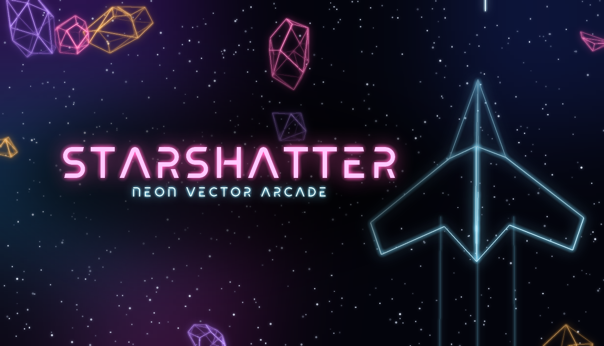
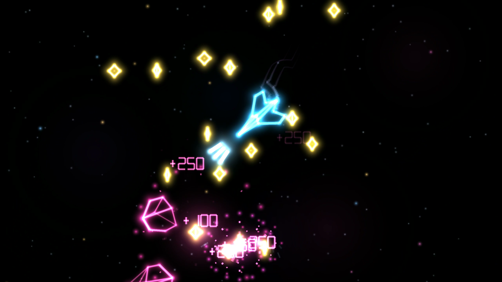
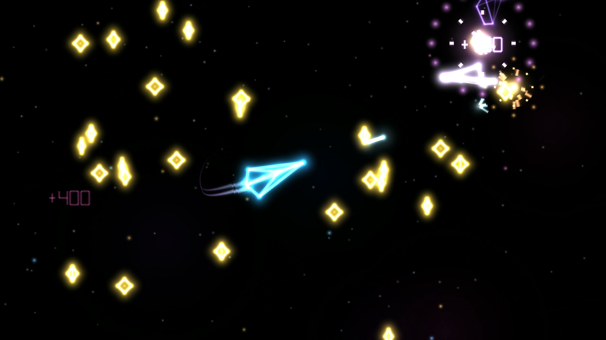
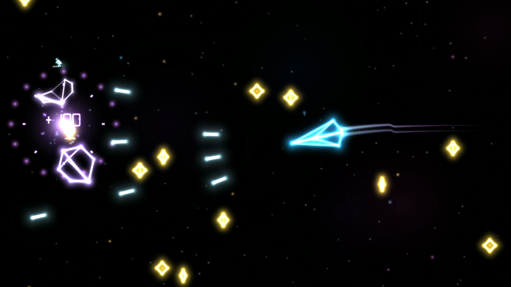
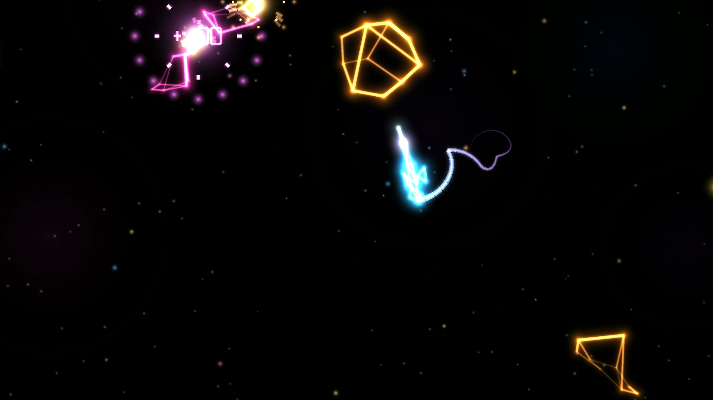
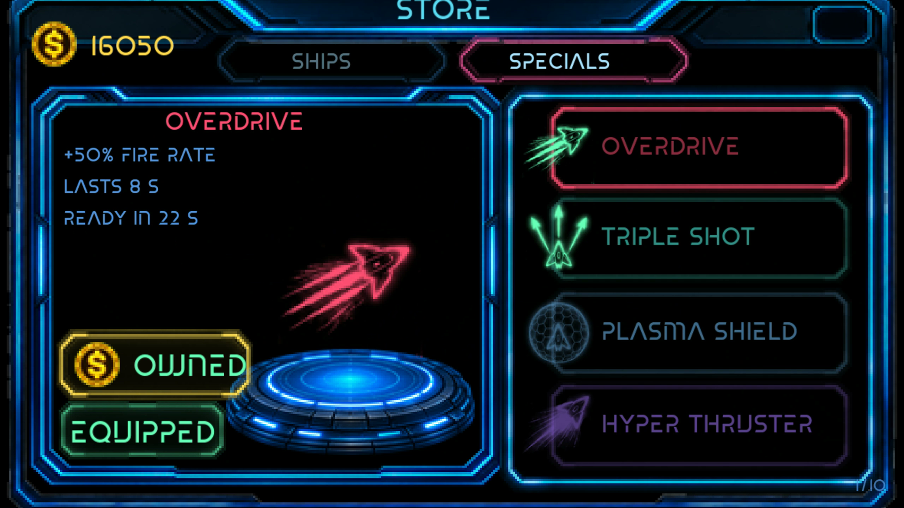
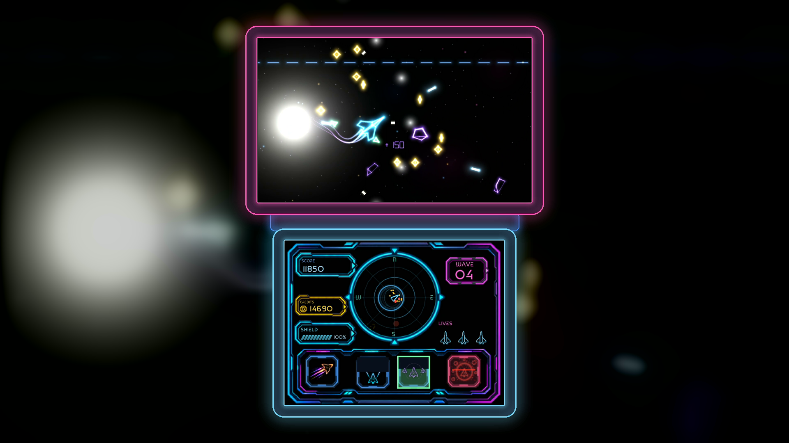
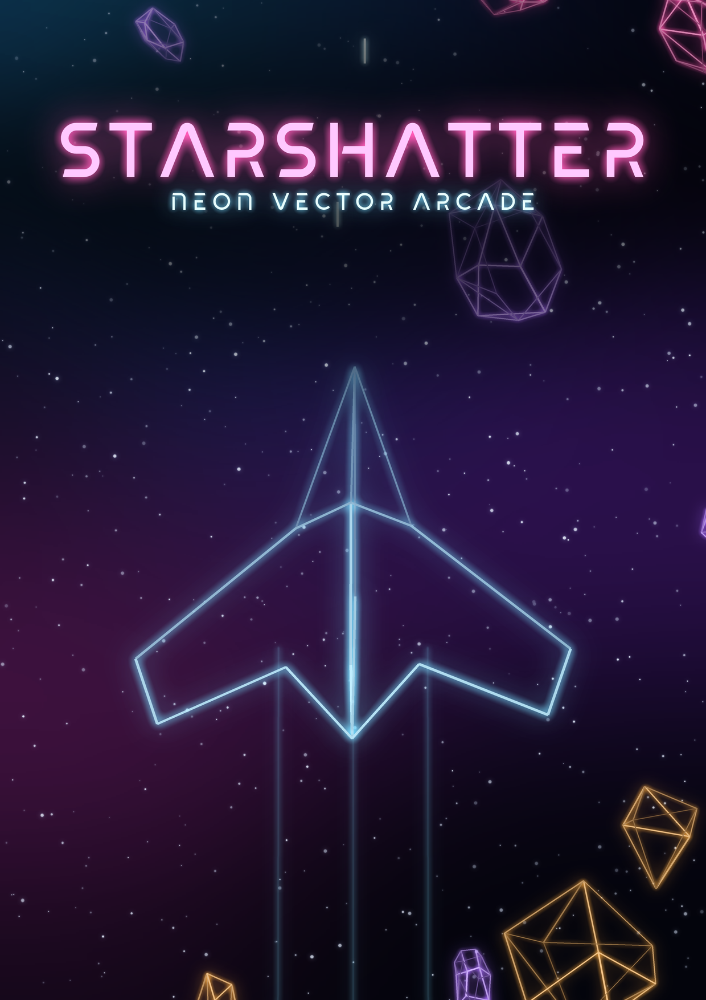

# STARSHATTER

**Neon vector arcade shooter.** Fly through a field of drifting rocks, break
them apart, collect credits, upgrade your ship and push further, wave after
wave. Free homebrew for the Nintendo 3DS.

## Download

[**Starshatter.3dsx**](Starshatter.3dsx)

## Screenshots

## How to play

Open `Starshatter.3dsx` in the [Azahar](https://azahar-emu.org) emulator
(**File > Load File**).

For sound on the emulator, Azahar needs a file at
`sdmc/3ds/dspfirm.cdc` inside its user folder (**File > Open Azahar Folder**).

## Controls

| Action | 3DS | Azahar (keyboard) |
| --- | --- | --- |
| Fly | Circle Pad / D-Pad | Arrow keys |
| Fire | R | W |
| Turbo | B | S |
| Cycle power-up | L | Q |
| Use power-up | A | A |
| Pause | START | M |
| Pick a power-up slot | Touch screen | Click |

## Credits

Game design, programming, art and audio: **Luis Santos**

Published by **TailHouse**.

Typeface: Skate Blade by Valerio Brotto (Silverblur_type), SIL Open Font
License 1.1. Built with devkitPro, libctru, citro2d and citro3d. Third-party
notices are in [THIRD-PARTY-NOTICES.txt](THIRD-PARTY-NOTICES.txt).

---

Starshatter is free homebrew and is not affiliated with or endorsed by
Nintendo.
